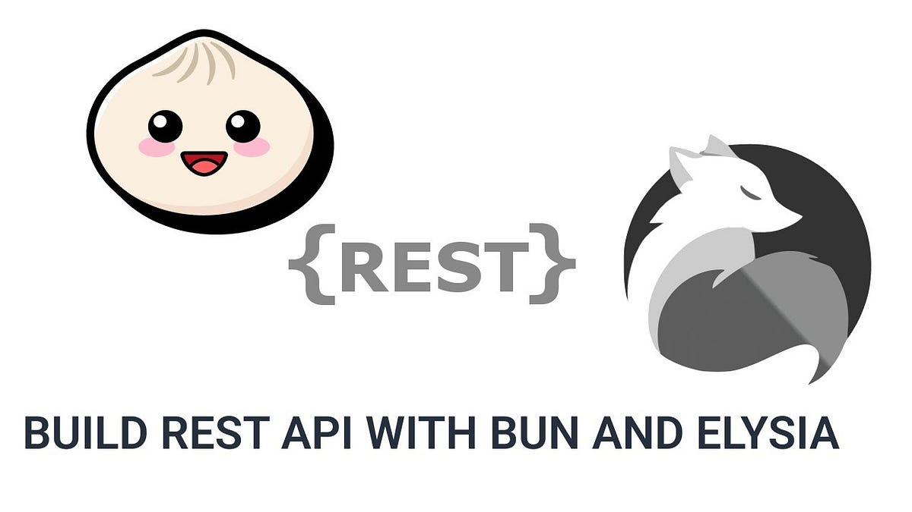

# Trabalho Final de Sistemas de Distribuídos - UFLA



Docentes:
- Pedro Eduardo Garcia
- Kleber Halley Sallum Guimarães
- Isaías Gonçalves Ribeiro

Discente:
- André De Lima Salgado

## Resumo

O projeto consiste na criação de um sistema de gerenciamento de livros por meio de uma API (Interface de Programação de Aplicações). Utilizamos dois frameworks principais, o "Bun" e o "Elysia.js", para facilitar o desenvolvimento e a implementação das funcionalidades do sistema.

A API oferece operações básicas de CRUD (Create, Read, Update, Delete) para manipular informações relacionadas a livros. Isso significa que o sistema permite:

1. **Inserir Livros:** Adicionar novos livros à base de dados por meio de requisições à API. Essa funcionalidade envolve o fornecimento das informações necessárias para criar um novo registro de livro.

2. **Editar Livros:** Atualizar as informações de livros existentes. Isso pode incluir a modificação de detalhes como título, autor, ano de publicação, entre outros.

3. **Visualizar Livros:** Obter informações sobre os livros armazenados na base de dados. Isso pode ser feito para recuperar detalhes específicos de um livro ou para listar todos os livros disponíveis.

4. **Excluir Livros:** Remover livros da base de dados. Essa operação envolve a identificação do livro a ser excluído por meio de uma solicitação à API.

De forma geral, o sistema permite uma interação eficiente e consistente com a base de dados de livros por meio de requisições à API, seguindo os princípios do CRUD. Isso proporciona uma maneira padronizada e escalável de gerenciar as informações relacionadas aos livros, tornando o processo mais acessível e flexível.


# Bun - Uma Nova Plataforma JavaScript

Bun é uma nova runtime JavaScript construída do zero para atender ao ecossistema moderno do JavaScript. Ela possui três metas de design principais:

- **Velocidade:** Bun inicia rapidamente e executa de maneira eficiente. Ele estende o JavaScriptCore, o motor JS voltado para o desempenho construído para o Safari e é até 29x mais rápida que o Node.js.;

- **APIs Elegantes:** Bun oferece um conjunto mínimo de APIs altamente otimizadas para realizar tarefas comuns, como iniciar um servidor HTTP e escrever arquivos.

- **Experiência de Desenvolvimento Coesa:** Bun é um conjunto completo de ferramentas para construir aplicativos JavaScript, incluindo um gerenciador de pacotes, executor de testes e empacotador.

Bun é projetado como uma substituição direta para o Node.js. Ele implementa nativamente centenas de APIs do Node.js e da Web, incluindo fs, path, Buffer e muito mais.

O objetivo do Bun é executar a maioria do JavaScript do lado do servidor do mundo e fornecer ferramentas para melhorar o desempenho, reduzir a complexidade e aumentar a produtividade do desenvolvedor.


## Bun API para livros

### Servidor de Desenvolvimento
Primeiro faça download do repositório, você pode rodar isso no seu terminal:
```bash
git clone https://github.com/PedroEduardoGarcia/gcc129-bun-api.git
```

Após o download do repositório, acessa a pasta do projeto e instale as dependências:
```bash
bun install
```

Para iniciar o servidor de desenvolvimento rode:
```bash
bun run dev
```

Em http://localhost:8000/ com o browser para ver o resultado.

### Como foi desenvolvido

#### Configurando um Projeto Bun

Primeiro, vamos criar um novo projeto Bun:

```bash
bun create elysia <name>
```

#### Rode a aplicação

Vá para o novo dir criado e rode:

```bash
bun run dev
```

Você deve ver algo desse tipo:

```bash
🦊 Elysia is running at localhost:8081
```

#### Adicionando SQLite

Agora vamos adicionar um banco de dados SQLite à nossa aplicação. Dentro da pasta src, crie um novo arquivo e nomeie-o como db.ts, veja o código a seguir:

```typescript
import { Database } from 'bun:sqlite';
 
export interface Book {
    id?: number;
    name: string;
    author: string;
}
 
export class BooksDatabase {
    private db: Database;
 
    constructor() {
        this.db = new Database('books.db');
        // Initialize the database
        this.init()
            .then(() => console.log('Database initialized'))
            .catch(console.error);
    }
 
    // Get all books
    async getBooks() {
        return this.db.query('SELECT * FROM books').all();
    }
 
    // Add a book
    async addBook(book: Book) {
        // q: Get id type safely
        return this.db.query(`INSERT INTO books (name, author) VALUES (?, ?) RETURNING id`).get(book.name, book.author) as Book;
    }
 
    // Update a book
    async updateBook(id: number, book: Book) {
        return this.db.run(`UPDATE books SET name = '${book.name}', author = '${book.author}' WHERE id = ${id}`)
    }
 
    // Delete a book
    async deleteBook(id: number) {
        return this.db.run(`DELETE FROM books WHERE id = ${id}`)
    }
 
    async getBook(id: number) {
      return this.db.query(`SELECT * FROM books WHERE id=${id}`).get() as Book;
    }
 
    // Initialize the database
    async init() {
        return this.db.run('CREATE TABLE IF NOT EXISTS books (id INTEGER PRIMARY KEY AUTOINCREMENT, name TEXT, author TEXT)');
    }
}
```

#### "Elysia decorate"

Podemos utilizar o banco de dados em nossos manipuladores (handlers) passando-o para o contexto do Elysia usando o 'decorate'.

Vamos modificar o arquivo index e adicionar o banco de dados (db) ao contexto do Elysia.

```typescript
import { Elysia, t } from "elysia";
import { BooksDatabase } from './db/db';
 
const app = new Elysia().decorate('db', new BooksDatabase)
 
app.get('/books', ({ db }) => db.getBooks());
app.post('/books', () => 'books')
app.put('/books', () => 'books')
app.get('/books/:id', () => 'books')
app.delete('/books/:id', () => 'books')
 
app.listen(8081)
 
 
console.log(
  `🦊 Elysia is running at http://${app.server?.hostname}:${app.server?.port}`
);
```

Agora, nosso primeiro ponto final (endpoint) utiliza o banco de dados SQLite do contexto.

#### "Elysia Schema"

Para definir tipos estritos para os manipuladores (handlers) do Elysia, introduzimos o uso de esquemas (schemas). O esquema garante segurança de tipo para parâmetros como o corpo da requisição.

Elysia também permite-nos acessar os parâmetros de caminho utilizando o objeto params do contexto do Elysia. Nós utilizamos os parâmetros de caminho nos pontos finais restantes para uma flexibilidade aprimorada.

Vamos modificar nosso código para usar o esquema para os nossos pontos finais (endpoints) de postagem (post) e atualização (put) e utilizar os parâmetros de caminho para os pontos finais restantes.


```typescript
import { Elysia, t } from "elysia";
import { BooksDatabase } from './db/db';
 
const app = new Elysia().decorate('db', new BooksDatabase)
 
app.get('/books', ({ db }) => db.getBooks());
app.post('/books', ({db, body }) => db.addBook(body), {
  body: t.Object({
    name: t.String(),
    author: t.String()
  })
})
app.put('/books', ({ db, body }) => db.updateBook(body.id, {name: body.name, author: body.author }), {
  body: t.Object({
    id: t.Number(),
    name: t.String(),
    author: t.String()
  })
})
 
app.get('/books/:id', ({db, params }) => db.getBook(parseInt(params.id)))
app.delete('/books/:id', ({db, params }) => db.deleteBook(parseInt(params.id)))
 
app.listen(8081)
 
 
console.log(
  `🦊 Elysia is running at http://${app.server?.hostname}:${app.server?.port}`
);
```

#### Plugins e conclusão

Por fim utilizamos de alguns plugins para lidar com cookies, JSON Web Token e swagger para podermos acessar nossa API no browser.


```typescript
import { Elysia, t } from "elysia";
import { cookie } from "@elysiajs/cookie";
import { swagger } from "@elysiajs/swagger";
import { jwt } from "@elysiajs/jwt";
import { BooksDatabase } from './db';
class Unauthorized extends Error {
  constructor(){
    super('Unauthorized');
  }
}

const app = new Elysia().use(swagger()).addError({
  '401': Unauthorized
}).onError(({ code, error}) => {

  let status;

  switch (true) {
    case code === 'VALIDATION':
      status = 400;
      break;
    case code === 'NOT_FOUND':
      status = 404;
      break;
    case code === '401':
      status = 401;
      break;
    default:
      status = 500;
  }

  return new Response(error.toString(), {status: status})
}).use(cookie()).use(jwt({
  name: 'jwt',
  secret: 'supersecret'
})).decorate('db', new BooksDatabase());

app.get('/books', ({db}) => db.getBooks());

app.post('/books', ({db, body}) => db.addBook(body), {
  body: t.Object({
    name: t.String(),
    author: t.String()
  })
})

app.put('/books', ({db, body }) => db.updateBook(body.id, { name: body.name, author: body.author}), {
  body: t.Object({
    id: t.Number(),
    name: t.String(),
    author: t.String()
  })
});

app.get('/books/:id', async ({db, params, jwt, cookie: {auth} }) => {

  const profile =  await jwt.verify(auth);

  if (!profile) throw new Unauthorized();


  return db.getBook(parseInt(params.id))
});

app.delete('/books/:id', ({db, params }) => db.deleteBook(parseInt(params.id)));

app.listen(8000);

console.log(
  `🦊 Elysia is running at ${app.server?.hostname}:${app.server?.port}`
);

```

Dessa forma podemos acessar a API em: http://localhost:8081/swagger

### Arquitetura

Em nosso sistema distribuído, desenvolvemos uma arquitetura que integra uma API e um banco de dados em uma mesma máquina. Abaixo, fornecerei uma descrição detalhada da arquitetura do sistema:

1. **Monolito Local:**
   - **API (Backend):** A aplicação é estruturada como um monolito, onde a lógica de negócios, manipulação de dados e a interface de programação de aplicativos (API) estão contidas em um único serviço.
   - **Banco de Dados:** O banco de dados está hospedado localmente na mesma máquina em que a API é executada. Isso simplifica a comunicação entre a API e o banco de dados, reduzindo a latência e aproveitando a alta velocidade de acesso aos dados locais.

2. **Comunicação Interna:**
   - **Comunicação Direta:** A comunicação entre a API e o banco de dados ocorre internamente na máquina, evitando a necessidade de comunicação através de redes externas. Isso contribui para um desempenho mais rápido, pois não há latência significativa associada à transmissão de dados pela rede.

3. **Vantagens da Abordagem:**
   - **Simplicidade:** A arquitetura monolítica simplifica o desenvolvimento e a manutenção, pois todas as partes do sistema estão contidas em uma única unidade.
   - **Desempenho Local:** Ao ter o banco de dados e a API na mesma máquina, aproveitamos a comunicação de alta velocidade e reduzimos a dependência de redes externas.
   - **Facilidade de Implantação:** A implantação do sistema é facilitada, pois todas as partes estão consolidadas em um único ambiente.

4. **Desafios Potenciais:**
   - **Escala Limitada:** A escalabilidade pode ser limitada devido à abordagem monolítica. Caso seja necessário escalar componentes independentemente, seria necessário considerar uma arquitetura mais distribuída.

5. **Melhorias Futuras:**
   - **Microsserviços:** Se a necessidade de escalabilidade ou flexibilidade surgir no futuro, poderíamos considerar a transição para uma arquitetura de microsserviços, onde cada componente (API, banco de dados) é separado e pode ser dimensionado independentemente.

Em resumo, nossa arquitetura atual visa a simplicidade e o desempenho, aproveitando a comunicação interna eficiente entre a API e o banco de dados em uma única máquina. Contudo, estamos cientes de possíveis desafios futuros e estamos abertos a considerar abordagens mais distribuídas conforme necessário.